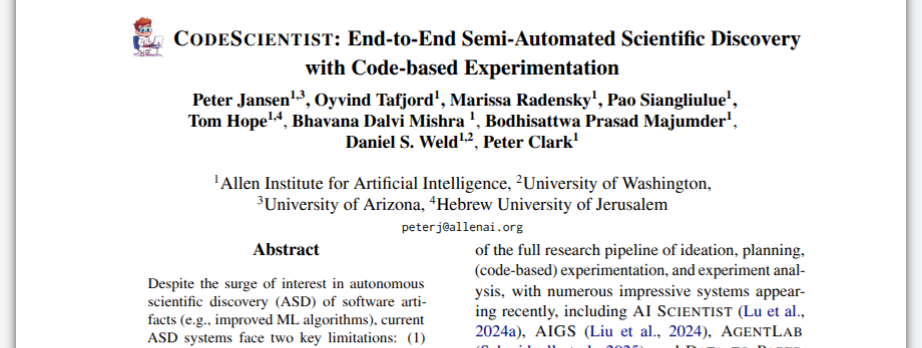
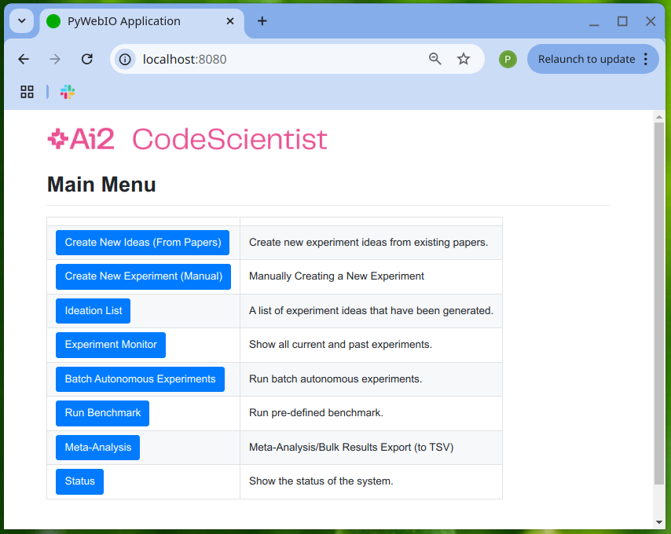
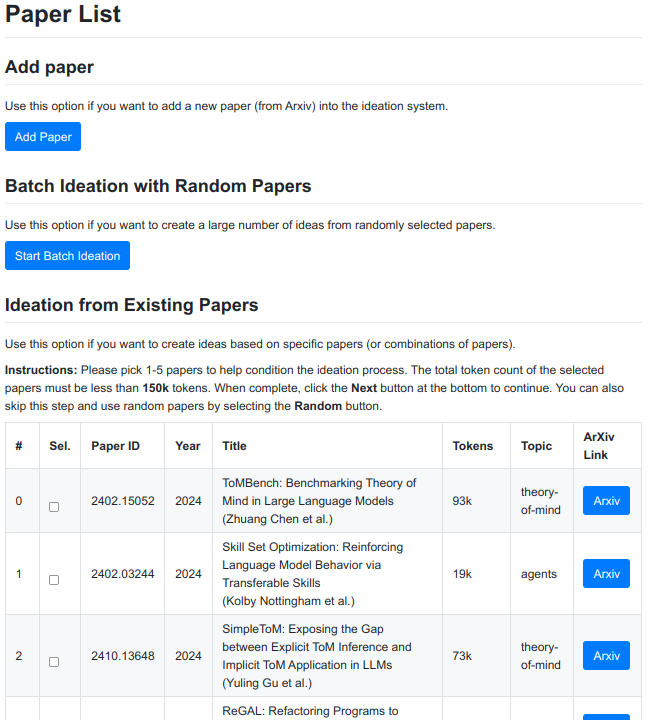
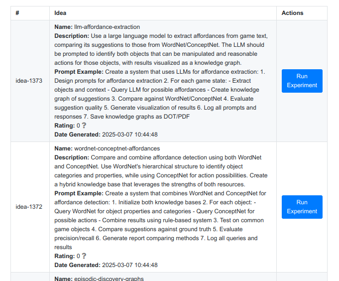
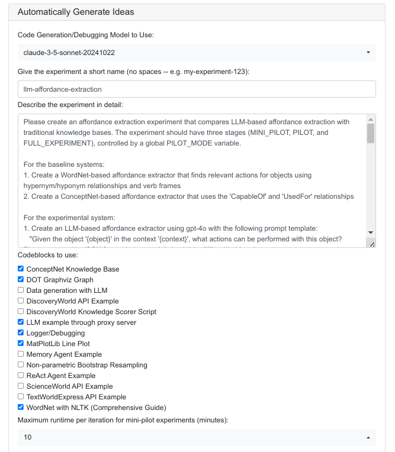
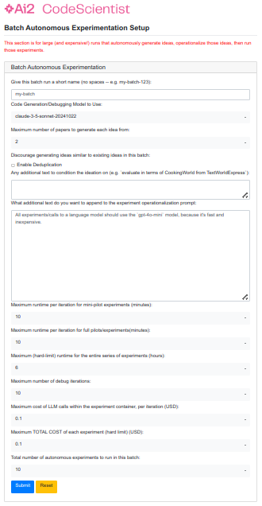
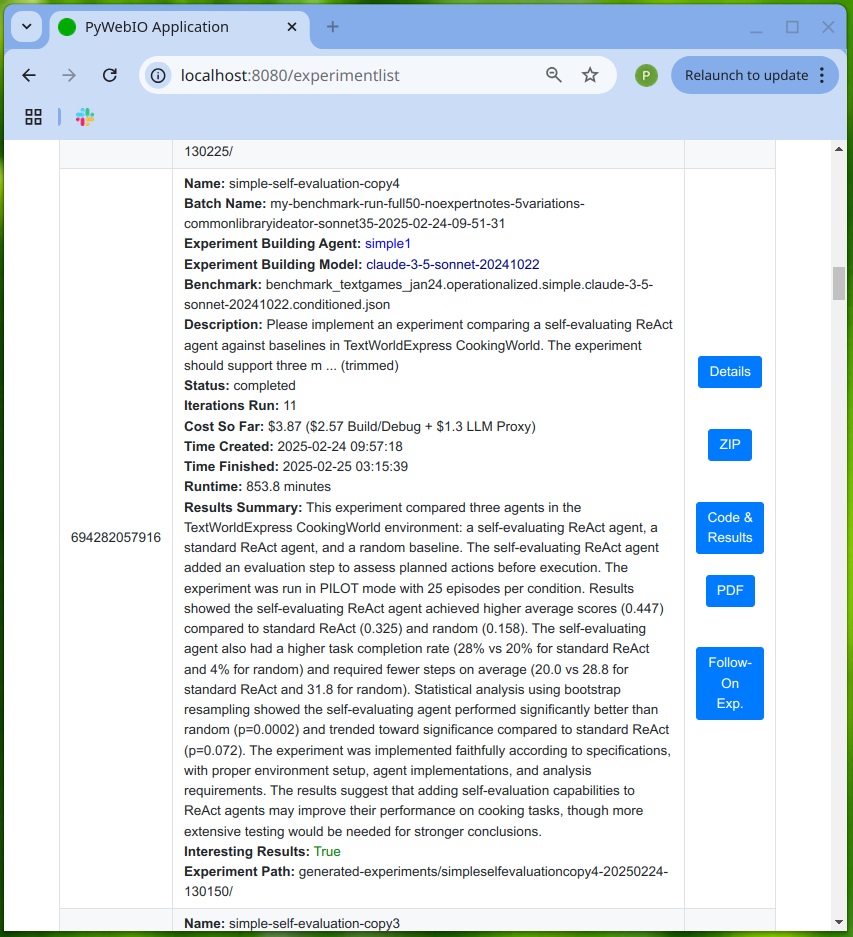
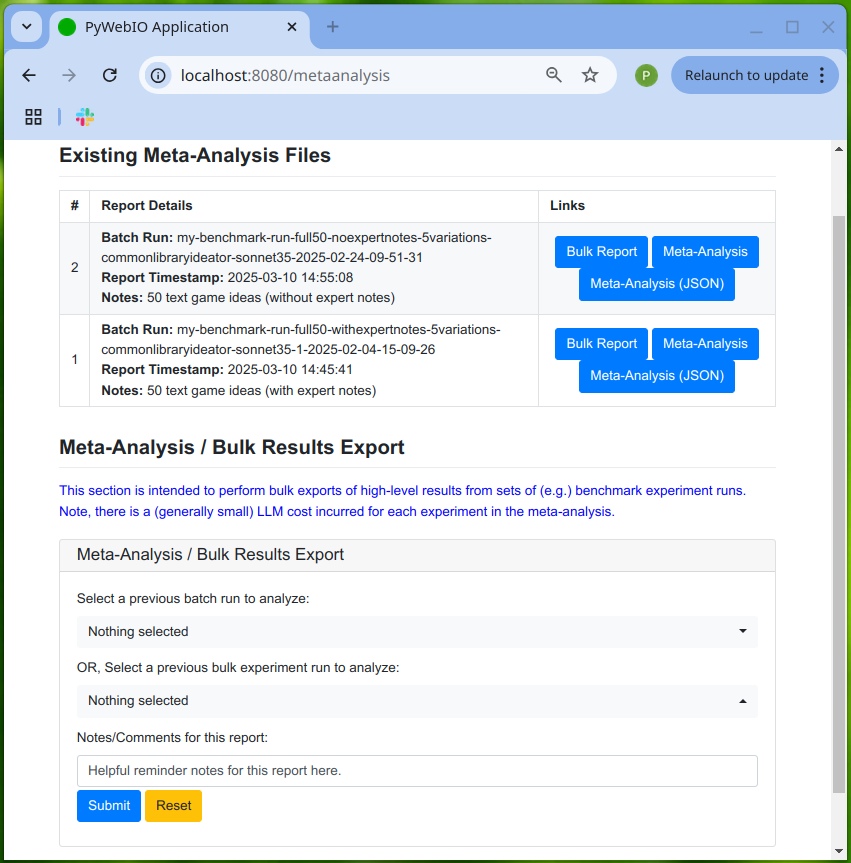
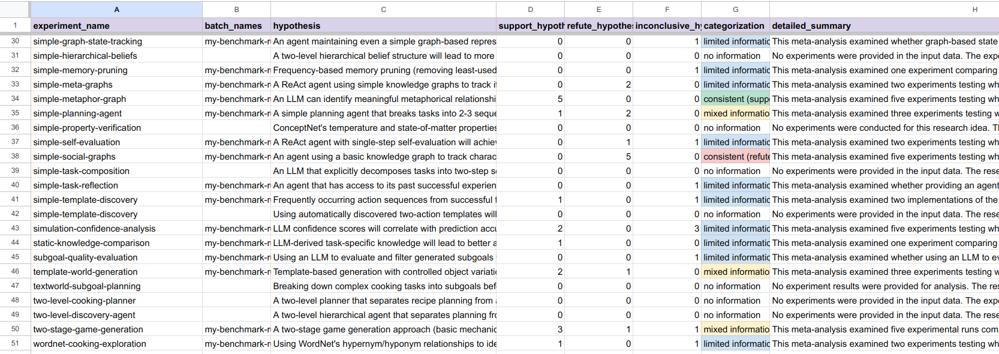

<div align="center">
  


</div>


---

This is the repository for **CodeScientist**, an end-to-end semi-automated scientific discovery system that designs, iterates, and analyzes scientific experiments that can be expressed as (Python) code.  *CodeScientist* creates novel ideas to explore essentially by using genetic mutations (using an LLM-as-a-mutator paradigm) to mutate *combinations of scientific articles and code examples*, with code examples including how to prompt an LLM, make a plot, or use a specific benchmark.  The experiment ideas can then be implemented using the Experiment Builder, which automatically creates, runs, and debugs the experiment code in a container.  When completed, *CodeScientist* writes a report on the results.  Usually, *CodeScientist* makes several (for example, 5) independent attempts at creating experiments for a given idea, and can create a meta-analysis describing the overall results over each of the 5 experiment attempts. 

**CodeScientist** can be run in two modes:
- **Human-in-the-loop:** A human helps build code examples, filter experiment ideas to run, and provides short comments on the ideas that might help their implementation.  This is the primary mode we report in the paper.
- **Fully-automatic:** You can run *CodeScientist* in fully automatic mode with a few clicks, though it is less efficient at producing scientific results.

What you'll find in this repository: 
- **CodeScientist Software:** *CodeScientist* is open source, and this repository includes the full set of software and installation instructions.
- **Reports:** The *CodeScientist* paper highlights a set of 20 candidate discoveries (in Table 4).  These are readily available here: [Example CodeScientist-Generated Experiment Reports and Code](#2-example-codescientist-generated-experiment-reports-and-code)

- **Raw Data:** The repository also includes a great deal of raw data: full experiment code, logs, ideas, external reviewer ratings, etc.

---

# Table of Contents

- [0. Paper](#0-paper)
- [1. Quick Start](#1-quick-start)
  - [1.1. I want to read about CodeScientist](#1-1-i-want-to-read-about-codescientist)
  - [1.2. I want to examine the papers, code, and other results created by CodeScientist](#1-2-i-want-to-examine-the-papers-code-and-other-results-created-by-codescientist)
  - [1.3. I want to run CodeScientist on my local machine](#1-3-i-want-to-run-codescientist-on-my-local-machine)
  - [1.4. I would like to use CodeScientist in my own domain](#1-4-i-would-like-to-use-codescientist-in-my-own-domain)
  - [1.5. I want to manually provide CodeScientist an idea to create an experiment for](#1-5-i-want-to-manually-provide-codescientist-an-idea-to-create-an-experiment-for)
  - [1.6. I want to feed ideas into CodeScientist from another system](#1-6-i-want-to-feed-ideas-into-codescientist-from-another-system)
  - [1.7. How do I use a specific aspect of CodeScientist?](#1-7-how-do-i-use-a-specific-aspect-of-codescientist)
  - [1.8. I have a question not answered here](#1-8-i-have-a-question-not-answered-here)
- [2. Example CodeScientist Generated Experiment Reports and Code](#2-example-codescientist-generated-experiment-reports-and-code)
  - (Experiment 1 – Experiment 6)
- [3. Installation and Running](#3-installation-and-running)
  - [3.1. Installation](#3-1-installation)
    - [Cloning the repository](#3-1-1-cloning-the-repository)
    - [Modal Setup](#3-1-2-modal-setup)
    - [API Key Setup](#3-1-3-api-key-setup)
    - [LLM Proxy Setup](#3-1-4-llm-proxy-setup)
  - [3.2. Running the Server and GUI](#3-2-running-the-server-and-gui)
- [4. Using CodeScientist](#4-using-codescientist)
  - [4.1. Create New Ideas (from Papers)](#4-1-create-new-ideas-from-papers)
  - [4.2. Create New Experiment (Manual)](#4-2-create-new-experiment-manual)
  - [4.3. Ideation List](#4-3-ideation-list)
  - [4.4. Batch Autonomous Experiments](#4-4-batch-autonomous-experiments)
  - [4.5. Run Benchmark](#4-5-run-benchmark)
  - [4.6. Experiment Monitor](#4-6-experiment-monitor)
  - [4.7. Bulk Reporting and Meta-Analysis](#4-7-bulk-reporting-and-meta-analysis)
    - [Generating New Reports](#4-7-1-generating-new-reports)
    - [Viewing Reports](#4-7-2-viewing-reports)
  - [4.8. Pregenerated Ideas/Filtering Ideas Externally](#4-8-pregenerated-ideasfiltering-ideas-externally)
    - [Step 1: Run the batch ideator](#4-8-1-step-1-run-the-batch-ideator)
    - [Step 2: Run batch idea simplifier and ranker](#4-8-2-step-2-run-batch-idea-simplifier-and-ranker)
    - [Step 3: Filter down the ideas](#4-8-3-step-3-filter-down-the-ideas)
    - [Step 4: Make plans for the (filtered) ideas](#4-8-4-step-4-make-plans-for-the-filtered-ideas)
  - [4.9. Your First Experiment -- "Hello World"](#4-9-first-experiment)
- [5. Adding Codeblocks to the Codeblock Library](#5-adding-codeblocks-to-the-codeblock-library)
  - [5.1. Browsing existing codeblocks](#5-1-browsing-existing-codeblocks)
  - [5.2. Adding a new codeblock](#5-2-adding-a-new-codeblock)
- [6. The Experiment Builder Sandbox](#6-the-experiment-builder-sandbox)
  - [6.1. Container Parameters](#6-1-container-parameters)
  - [6.2. LLM Proxy](#6-2-llm-proxy)
  - [6.3. Example LLM usage log](#6-3-example-llm-usage-log)
  - [6.4. Example Debugger Log (log.json)](#6-4-example-debugger-log-logjson)
  - [6.5. LLM-generated code breaking the sandbox](#6-5-llm-generated-code-breaking-the-sandbox)
- [7. Data](#7-data)
  - [7.1. Included Data](#7-1-included-data)
  - [7.2. Data Not Included in the Repository](#7-2-not-included-data)
  - [7.3. Resetting the Data](#7-3-resetting-data)
  - [7.4. Additional Data Available](#7-4-additional-data)
- [8. Benchmark](#8-benchmark)
- [9. Using parts of CodeScientist in your own codebase](#9-using-parts-of-codescientist-in-your-own-codebase)
- [10. Prompts](#10-prompts)
- [11. Frequently Asked Questions](#11-frequently-asked-questions)
- [12. Danger Zone](#12-danger-zone)
- [13. Citation](#13-citation)
- [14. License](#14-license)
- [15. Contact](#15-contact)


<span id='0-paper'/>

## 0. Paper 

*CodeScientist* is described in the following paper: [CodeScientist: End-to-End Semi-Automated Scientific Discovery with Code-based Experimentation](https://allenai.org/papers/codescientist).



<span id='1-quick-start'/>

## 1. Quick Start

<span id="1-1-i-want-to-read-about-codescientist"/>

### 1.1. I want to read about CodeScientist
The CodeScientist paper is available here: [Section 0. Paper](#0-paper)

<span id="1-2-i-want-to-examine-the-papers-code-and-other-results-created-by-codescientist"/>

### 1.2. I want to examine the papers, code, and other results created by CodeScientist
- **Appendix:** A number of the highest quality experimental results (as rated by humans) are in the paper's Appendix.
- **Example Papers:** You can also see the above highly rated experimental results (and a number of rejected papers) here: [example_papers/](example_papers)
- **Lots of Papers:** If you'd like all the details -- high-quality and low-quality experiments, including their papers, code, results, and logs, they are available in bulk here: [generated_experments/](generated_experiments)

<span id="1-3-i-want-to-run-codescientist-on-my-local-machine"/>

### 1.3. I want to run CodeScientist on my local machine
Please see the installation instructions in  [Section 3.1. Installation](#3-1-installation)

<span id="1-4-i-would-like-to-use-codescientist-in-my-own-domain"/>

### 1.4. I would like to use CodeScientist in my own domain.
To use CodeScientist in a subdomain other than the provided domain (i.e. agents and environments), there are two steps:
- *Add papers in the subdomain:* This is as easy as pasting Arxiv links into the `Create New Ideas (from Papers)` menu item.
- *Add codeblocks:* If you need specialized codeblocks for your domain other than the general ones provided in this repository, simply add them to the `codeblocks` directory in the required format.

More information on these steps is provided in [Section 3. Installation and Running](#3-installation-and-running) and [Section 4. Using CodeScientist](#4-using-codescientist)

<span id="1-5-i-want-to-manually-provide-codescientist-an-idea-to-create-an-experiment-for"/>

### 1.5. I want to manually provide CodeScientist an idea to create an experiment for, instead of using LLM-generated ideas.
You can do this by pressing the `Create New Experiment (Manual)` button on the main menu.
More detailed instructions on running CodeScientist are provided in  [Section 4.2. Create New Experiment (Manual)](#4-2-create-new-experiment-manual)

<span id="1-6-i-want-to-feed-ideas-into-codescientist-from-another-system"/>

### 1.6. I want to feed ideas into CodeScientist that were made from some other system.
You can do this in bulk using the `Run Benchmark` button -- see the section on pre-generating ideas for an example of the format *CodeScientist* expects here: [Secton 4.8 .Pregenerated Ideas/Filtering Ideas Externally](#4-8-pregenerated-ideasfiltering-ideas-externally), followed by [Section 4.5. Run Benchmark](#4-5-run-benchmark)


<span id="1-7-how-do-i-use-a-specific-aspect-of-codescientist"/>

### 1.7. How do I use [specific aspect of CodeScientist]?
Please see the instructions for various components in the detailed usage instructions of [Section 4. Usage Instructions](#4-using-codescientist)


<span id="1-8-i-have-a-question-not-answered-here"/>

### 1.8. I have a question not answered here. 
Please see the documentation below.  If you're question isn't answered, please [add an issue](https://github.com/allenai/codescientist/issues). 

<span id="2-example-codescientist-generated-experiment-reports-and-code"/>

## 2. Example CodeScientist Generated Experiment Reports and Code
Below are six example experiment reports (and supporting code) generated by *CodeScientist* (from Table 4 in the *CodeScientist* paper). Note that the full experiment logs, code, results files, etc., for these (and other) experiments are available in: [example_experiments/](example_experiments) 

*(The reports are intended to be quickly-read overviews that describe the bulk of the experiment, and do not include literature reviews or discussions)* 

### Experiment 1: Analyzing LLM Confidence in TextWorldExpress State Predictions

**Summary:** This paper examines the relationship between large language model (LLM) confidence scores and prediction accuracy in a text-based game environment. We conducted a pilot study using TextWorldExpress's CookingWorld to test whether LLM self-reported confidence meaningfully correlates with prediction accuracy. Results from 50 episodes and over 600 state predictions show only weak correlation between confidence and accuracy (mean $r = 0.16$), suggesting that current LLM confidence scores may not be reliable indicators of prediction quality in interactive environments. 

[📄 Paper PDF](example_papers/report1.simulationconfidenceanalysis.pdf) | [💻 Code](example_papers/code1.simulationconfidenceanalysis.py)  


### Experiment 2: Impact of State Representation Complexity on LLM Simulation Accuracy in CookingWorld

**Summary:** This paper investigates how increasing state representation complexity affects the ability of large language models (LLMs) to accurately simulate state transitions in the CookingWorld environment. We tested four levels of state complexity (boolean, numerical, relational, and full) and measured prediction accuracy across 25 episodes with up to 25 steps each. Our results show a clear inverse relationship between state complexity and simulation accuracy, with boolean representations achieving the highest accuracy (94.5\%) and full state representations the lowest (81.9\%). These findings suggest that while LLMs can effectively simulate simple state transitions, their performance degrades significantly with increased state complexity.

[📄 Report PDF](example_papers/report2.progressivestatecomplexity.pdf) | [💻 Code](example_papers/code2.progressivestatecomplexity.py)  


### Experiment 3: Comparing Single-Stage vs Two-Stage Approaches for Text Game Generation

**Summary:** This paper investigates whether a two-stage approach to generating text-based games using large language models (LLMs) produces more complete and robust implementations compared to single-stage generation. We conducted a controlled experiment comparing single-stage generation against a two-stage process where basic mechanics are generated first, followed by scoring and win conditions. Results show that while both approaches achieved 100\% execution success, the two-stage approach produced significantly more complete game implementations (96.7\% vs 66.7\% mechanics completion rate), though at the cost of longer generation times. These findings suggest that decomposing complex game generation tasks into focused subtasks leads to higher quality output.

[📄 Report PDF](example_papers/report3.twostagegamegeneration.pdf) | [💻 Code](example_papers/code3.twostagegamegeneration.py)  


### Experiment 4: Evaluation of LLM-Based vs Mathematical Approaches for Resistor Substitution

**Summary:** This paper evaluates three approaches for suggesting resistor combinations to match target resistance values: an LLM-based advisor, a simple baseline using nearest values, and a mathematical optimization approach. Testing on 50 random target values between 10$\Omega$ and 1M$\Omega$ showed that while the LLM approach achieved only 24\% accuracy within 1\% tolerance, the simple baseline achieved 94\% and the mathematical optimization achieved 100\%. The results suggest that for this well-defined numerical problem, traditional algorithmic approaches outperform current LLM capabilities.

[📄 Report PDF](example_papers/report4.resistorsubstitutionadvisor.pdf) | [💻 Code](example_papers/code4.resistorsubstitutionadvisor.py)  


### Experiment 5: Evaluating LLM Action Prediction and Confidence Estimation in Text-Based Games

**Summary:** This study evaluates the ability of a large language model (GPT-4o-mini) to predict action outcomes and assign meaningful confidence scores in a text-based cooking game environment. Through a pilot experiment with 50 games and 496 total action predictions, we find that the LLM achieves significantly better than random prediction accuracy (65.7\% vs 50\% baseline, p < 0.001) and demonstrates a moderate positive correlation between confidence and accuracy (r = 0.335, p < 0.001). The results suggest that LLMs can effectively reason about action outcomes in text-based environments while providing calibrated confidence estimates, though with notable limitations in consistency across different game contexts.

[📄 Report PDF](example_papers/report5.confidencesimulation.pdf) | [💻 Code](example_papers/code5.confidencesimulation.py)  


### Experiment 6: Evaluation of Knowledge Graph-Based Agent for Scientific Discovery in DiscoveryWorld

**Summary:** This paper presents an experimental evaluation of a knowledge graph-based agent for scientific discovery in the DiscoveryWorld environment, comparing it against a baseline ReAct agent. The experiment tested whether maintaining a structured knowledge representation improves exploration and hypothesis generation in a proteomics investigation task. Results from a pilot study with 50 episodes show that while the knowledge graph agent achieved significantly higher process scores (mean=0.29 vs 0.12, p<0.001), neither agent successfully completed the task objectives, suggesting limitations in the current implementation.

[📄 Report PDF](example_papers/report6.knowledgegraphdiscovery.pdf) | [💻 Code](example_papers/code6.knowledgegraphdiscovery.py)  


<span id="3-installation-and-running"/>

## 3. Installation and Running

**Requirements:** *CodeScientist* was developed on Ubuntu Linux, should work with minimal effort on most MacOS distributions, and may work with modification on Windows.  The containers that *CodeScientist* writes experiment code for target a Ubuntu 22.04 distribution.

<span id="3-1-installation"/>

### 3.1. Installation

<span id="3-1-1-cloning-the-repository"/>

#### Cloning the repository

Clone this repository:
```
git clone https://github.com/allenai/codescientist
cd codescientist
```

Create a conda environment:
```
conda create --name codescientist python=3.12
conda activate codescientist
```

Install the dependencies:
```
pip install -r requirements.txt
```

For report writing, ensure you have a Latex distribution installed, and that it is available as `pdflatex` on the command line.  If not, you will need to install one.  For example, on Ubuntu, this might be: 
```
sudo apt-get install texlive-full
```
It's *not* recommended to use a minimal distribution (e.g. `texlive-latex-base`) -- you never know what Latex the LLM will generate, and it's best to give it the widest available features so it reduces failures.

CodeScientist executes a number of experiments simultaneously in threads. Optionally, you can raise or lower this number by altering the value in `config_threads.json`:
```
{
    "max_experiment_threads": 10
}
```


<span id="3-1-2-modal-setup"/>

#### Modal Setup

The experiments that *CodeScientist* creates are not run locally, but rather on containers provided by the cloud service [modal.com](http://www.modal.com).  To use *CodeScientist*, you will need to sign up for a Modal account.  At the time of this writing, Modal.com provides a small amount of free credits per month, which is generally enough to run a small number of CPU-only experiments.

To setup Modal, visit [modal.com](http://www.modal.com) and follow their sign-up and setup instructions.  This nominally looks something like:

- Sign up for a free-tier Modal.com account
- Run `pip install modal` to install their package
- Run `modal setup` to authenticate

The instructions may have changed when you read this -- it's recommended you follow the latest version of their sign-up and setup procedure.

<span id="3-1-3-api-key-setup"/>

#### API Key Setup

*CodeScientist* looks for API keys for common models in a file in the root *CodeScientist* directory called `api_keys.donotcommit.json`:
```
{    
    "openai": "key_here",
    "anthropic": "key_here",
    "togetherai": "key_here",
    "deepseek": "key_here"    
}
```

Most of the calls use `Anthropic` models, and some use `OpenAI` models -- you should minimally populate both.  **Make sure the keys that you provide have low budgets, and monitor their usage.**

**Hard Cost Limit:** There is a run-away hard-cost limit set in [src/ExtractionUtils.py](https://github.com/allenai/codescientist/blob/4b43a3ddcb92ee881c1828200e9353e030d60ac2/src/ExtractionUtils.py#L20), through the `LLM_COST_HARD_LIMIT` variable.  This isn't intended to replace a hard limit on your API keys.  If you're planning a large run, you will likely want to adjust this hard limit before the run.  Once the estimated costs exceed this limit, the *CodeScientist* Python server does a hard exit.  This is intended as a last resort, and may require you to manually clean up any running Modal containers -- so you should try to avoid this if possible.

<span id="3-1-4-llm-proxy-setup"/>

#### LLM Proxy Setup

When *CodeScientist* creates experiments, those experiments may themselves make LLM calls. The costs for specific LLM models are noted using the [llm-proxy/experiment-llm-cost.json](llm-proxy/experiment-llm-cost.json) file, which you (optionally) may wish to update:
```
{
    "example-model-name":           {"cost_per_1M_prompt_tokens": 20.0, "cost_per_1M_completion_tokens": 20.0},
    "gpt-3.5-turbo-1106":           {"cost_per_1M_prompt_tokens": 1.00, "cost_per_1M_completion_tokens": 2.00},
    "gpt-4-turbo":                  {"cost_per_1M_prompt_tokens": 10.0, "cost_per_1M_completion_tokens": 30.00},
    "gpt-4o":                       {"cost_per_1M_prompt_tokens": 2.50, "cost_per_1M_completion_tokens": 10.00},
    "gpt-4o-mini":                  {"cost_per_1M_prompt_tokens": 0.15, "cost_per_1M_completion_tokens": 0.60},
    "o1-preview":                   {"cost_per_1M_prompt_tokens": 15.00, "cost_per_1M_completion_tokens": 60.00},
    "o1-mini":                      {"cost_per_1M_prompt_tokens": 3.00, "cost_per_1M_completion_tokens": 12.00},
    "claude-3-5-sonnet-20240620":   {"cost_per_1M_prompt_tokens": 3.00, "cost_per_1M_completion_tokens": 15.00},
    "claude-3-5-sonnet-20241022":   {"cost_per_1M_prompt_tokens": 3.00, "cost_per_1M_completion_tokens": 15.00},
    "together_ai/mistralai/Mixtral-8x7B-Instruct-v0.1": {"cost_per_1M_prompt_tokens": 0.60, "cost_per_1M_completion_tokens": 0.60},
    "together_ai/meta-llama/Meta-Llama-3.1-8B-Instruct-Turbo": {"cost_per_1M_prompt_tokens": 0.18, "cost_per_1M_completion_tokens": 0.18},
    "text-embedding-3-large":        {"cost_per_1M_tokens": 0.12},
    "text-embedding-3-small":        {"cost_per_1M_tokens": 0.02}
}
```
You can add new LLMs to this as needed.

<span id="3-2-running-the-server-and-gui"/>

### 3.2. Running the Server and GUI
The back-end server can be spawned with the following command:
```
python src/CodeScientistWebServer.py
```

In another terminal window, you can spawn the front-end GUI using the following command:
```
python src/CodeScientistWebInterface.py
```

You should then see a message that looks something like: 
```
 * Running on http://127.0.0.1:8080/ (Press CTRL+C to quit)
```

Pointing your web browser to that URL should show the main menu:

|  |
|---|

<span id="4-using-codescientist"/>

The section below describes the usage of each section of *CodeScientist*, and culminates in [Section 4.9. Your First Experiment -- "Hello World"](#4-9-first-experiment) .


## 4. Using CodeScientist

There are a few different workflows that a *CodeScientist* user might work within:
- **Manual**: You'd like to manually generate ideas, and manually select the ideas to run experiments for.
- **Automatic**: You'd like to automatically have *CodeScientist* generate ideas and run experiments for those ideas.
- **Benchmark/Batch**: You'd like to generate a batch of ideas, perform some filtering on them (which may or may not include adding some human comments on the ideas), and then run all the experiments for these ideas.  This is the mode that was used in the paper.

For **Manual**, you'll like use the `Create New Ideas` functionality to make new ideas, then `Ideation List` to select specific ideas to run experiments for, before using `Experiment Monitor` to keep track of their progress, and the `Meta-Analysis` button to generate reports on the results.  (Note, for manual **including manually adding in the ideas**, you can skip the *create new ideas* and *ideation list*, and just directly use the `Create New Experiment (Manual)` functionality. 

For **Automatic**, you'll likely use the `Batch Autonomous Experiments` function to spool up a large number of fully-autonomous experiments.  You can monitor their progress with the `Experiment Monitor`, and use the `Meta-Analysis` button to generate reports on the results. 

For **Benchmark/Batch**, you can feed in pre-generated ideas (generated using a proces described below) using the `Run Benchmark` button, and similarly monitor the progress of the experiments using the `Experiment Monitor`, and generate reports using the `Meta-Analysis` button.

<span id="4-1-create-new-ideas-from-papers"/>

### 4.1 Create New Ideas (from Papers)

The `Paper List` allows you to create new ideas from combinations of papers (that have been ingested by the system).  You can either select specific papers to ideate from, or have the ideator randomly select papers itself.  

|  |
|---|

The *CodeScientist* ideator uses the full text of papers, and to make extracting the full-text easier, the papers must (currently) be added as *Arxiv* links (which allows downloading their full Latex source).  This avoids the challenges of PDF-to-text conversion.

Ideas can take a few minutes to generate.  When they're complete, they'll be visible in the `ideation list`. 

**:warning: Important:** If your ideas don't appear to be generating, and you're seeing errors of the form `ERROR: Could not retrieve source for paper with ID: xxxx.xxxxx` in the server console, then you likely have not yet downloaded the Paper data.  This can be accomplished by running `python src/PaperStore.py` and answering `yes` to the question of whether you'd like to redownload and process the paper corpus.  This generally takes about 40 minutes.

<span id="4-2-create-new-experiment-manual"/>

### 4.2 Create New Experiment (Manual)

You can also completely bypass the ideator/planner, and just tell CodeScientist what experiment you'd like it to run using the `Create New Experiment (Manual)` dialog:

|  |
|---|

Some helpful tips:
- **Details:** Describe the experiment in as much detail as possible.  This is the only description *CodeScientist* will have to understand what experiment you'd like it to implement.
- **Pilot:** The experiment builder is designed to build experiments in 3 stages: **MINI_PILOT, PILOT, and FULL_EXPERIMENT**.  The purpose of the mini_pilot is to quickly find bugs with as little time/cost as possible.  You should explicitly describe what each stage looks like.  This might be as simple as saying that in the *mini_pilot* you'll run 2 samples, in the *pilot* you'll run 10, and in the *full_experiment* you'll run 100.  It's also common to say something like `stop before running the full experiment, so I can manually verify the results` -- so that you're not asking *CodeScientist* to run large (and potentially expensive) experiments without first checking that you want to run them after the *pilot*.
- **Codeblocks:** Don't forget to select which codeblocks you think the Experiment Builder will need to construct the experiment successfully.  The `Debugger/Logger` should always be selected, at a minimum.  If your experiment code is expected to make code to external LLMs (like OpenAI), you will also need to include the LLM proxy codeblock.

<span id="4-3-ideation-list"/>

### 4.3 Ideation List 

The ideation list shows all the ideas that have been generated by the ideation components of the system.  It allows you to browse them, and select ideas that you'd like to run experiments for.

|  |
|---|

If you're interested in running a specific experiment, press the `Run Experiment` button beside it.  That will start a series of dialogs that prompt you to run the idea through the planner(and then ultimately allow submitting the experiment to the queue to be run).  While you're at the planning stage, the dialog allows you to edit the experiment plan, the specific codeblocks to be included in the prompt, and a number of other hyperparameters: 

|  |
|---|

<span id="4-4-batch-autonomous-experiments"/>

### 4.4 Batch Autonomous Experiments

This section is for the "just hit this button and it will autonomously come up with ideas and run experiments for them" mode -- i.e. fully autonomous automated scientific discovery.

|  |
|---|

This is similar to the other experiment submission modes, with a few additions:
- **Additional conditioning text for ideation:** If you'd like to steer the ideation in any way (e.g. *evaluate in terms of CookingWorld from TextWorldExpress*), you can include those instructions here, that will be included in the ideation prompt.
- **Additional conditioning text for planning/operationalization:** If you'd like to steer the planner/operationalizer in any way (e.g. *all external LLM calls should be to `gpt-4o-mini`, because it's fast an inexpensive*), these will be included in the prompt that converts the idea into a plan.
- **Batch Run Name**: Give a helpful human-readable name to your run, to help find it in the `meta-analysis/reporting` tab later.

<span id="4-5-run-benchmark"/>

### 4.5 Run Benchmark

Running a benchmark is essentially a method to run a list of pre-generated ideas (and plans for those ideas) through the experiment construction system.  The dialog looks similar to the other experiment submission dialogs, with a few modifications:
- **Benchmark Name**: Pick a benchmark to run from this selection box (these are automatically detected in the [data/](data/) folder)
- **Total Copies of Each Experiment to Run**: If you'd like to perform meta-analyses, this number should be greater than one.
- **Batch Run Name**: Give a helpful human-readable name to your run, to help find it in the `meta-analysis/reporting` tab later.

<span id="4-6-experiment-monitor"/>

### 4.6 Experiment Monitor

The experiment monitor helps keep track of each experiment that's been submitted, it's current status (queued/completed), and a short summary of its results. 
|  |
|---|

A number of buttons are present for completed (and *successful*) experiments: 
- **ZIP**: Download the entire experiment archive (code, results, etc.)
- **Code & Results**: Show the code and results (in HTML)
- **PDF**: Show the automatically generated report
- **Follow-on Experiment**: Perform a follow-on experiment where you request modifications (such as increasing the sample size). 

**:warning: Why can I only see the summary for experiments, and not the code, reports, etc?:** This data is available separately in a large archive.  If you'd like to see the code, reports, etc., described in the paper, please see the instructions for downloading them in the [generated-experiments/](generated-experiments) folder.

<span id="4-7-bulk-reporting-and-meta-analysis"/>

### 4.7 Bulk Reporting and Meta-Analysis 

The bulk reporting and meta-analysis steps collect the results (and high-level summary statistics, like runtime and cost) from a large set of experiments, and allow exporting these into a tab-delimited file to easily import into a spreadsheet. 

|  |
|---|

The meta-analysis menu shows all previously generated reports at the top, while allowing you to generate new reports using the dialog at the bottom. 

<span id="4-7-1-generating-new-reports"/>

#### Generating New Reports
You can generate new reports by either `batch run` name (if you were running, for example, bulk experiments), or by `experiment name` (if you were running many instances of the same experiment). 

**Clustering:** Internally, the meta-analysis/report functionality groups together all experiments that had the same `experiment plan` prompt from the operationalizer/planner step.  So if you're (e.g.) running the same benchmark ideas with slightly different operationalization instructions for the planner (e.g. use `gpt-4o-mini`, or expert comments, or a specific benchmark), then it should generally group these different runs as different meta-analyses.

**Cost:** The meta-analysis requires a number of LLM calls.  The meta-analyes for the set of 50x5 (250) experiments in the paper cost approximatley $1. 

**Time:** The meta-analyses and bulk reports can take a few minutes to generate, particularly for large sets of experiments.  When completed, the report will show up on the report list (though you will have to refresh the page to see it). 

**Multiple Experiments:** For the meta-analysis to work, it requires that you run multiple copies of the same experiment.  For example, when running a benchmark, you'll have to select a number greater than 1 (e.g. 5) for the number of copies of each experiment to run.

<span id="4-7-2-viewing-reports"/>

#### Viewing Reports

**Bulk Report:** This shows each experiment that was run, summary statistics (e.g. time/cost), and short summaries of results.  If you're interested in manually analyzing the results at a high-level, this is the file to start with. 

**Meta-Analysis:** Each line in this file represents a group of experiments.  Summary statistics (the number of experiments supporting, refuting, or inconclusive towards the hypothesis) and overall LLM-generated meta-analysis are included. A JSON version is also available, with more information.

The meta-analysis uses one LLM call per group of experiments, and there is some variability across calls.  You can perform the meta-analysis manually (as we did for the paper) if you'd like to also browse specific experiments, and choose which ones to rerun with higher numbers of samples, etc.

|  |
|---|


<span id="4-8-pregenerated-ideasfiltering-ideas-externally"/>

## 4.8 Pregenerated Ideas/Filtering Ideas Externally


#### Manually generating a large number of ideas in batches. 
While the CodeScientist user interface includes functionality to generate (and run) experiment ideas, sometimes you might want to generate ideas at scale offline.  For example, the CodeScientist paper generates a large number of ideas that were (externally) filtered down by a human before being provided back into CodeScientist. 

Manually generating ideas can be accomplished using the following manual process, using a set of scripts: 

*(Note, if you'd like to see the files that are output at each step of this process, examples are provided in [example_batch_ideation/](example_batch_ideation/)`).*

<span id="4-8-1-step-1-run-the-batch-ideator"/>

##### Step 1: Run the batch ideator:
To run the batch ideator, call:
```
python src/BatchPregeneratedIdeator.py
```

This will generate an output file (e.g. `batch-generation-example-output.json`) that's an IdeaStore containing the raw ideas.  (Note that you can modify `BatchPregeneratedIdeator.py` to change a number of hyperparameters.)

<span id="4-8-2-step-2-run-batch-idea-simplifier-and-ranker"/>

##### Step 2: Run batch idea simplifier and ranker
Before you manually filter the subset of ideas, you may want to do two things (that this tool provides):
- Make "simplified" versions of each idea, that are likely to be more implementable
- Sort the ideas based on an "implementability" score, which is (essentially) an aggregate of how many external resources or new codeblocks each idea requires.

To run the simplifier/ranker, run:
```
python src/BatchIdeatorRanker.py
```

This will generate an output file that includes the simplified ideas, and the scores for each idea (e.g. `batch-generation-example-output.ranked.simplified.json`)

<span id="4-8-3-step-3-filter-down-the-ideas"/>

##### Step 3: Filter down the ideas
Use your favorite method (a text editor, graphical interface, an automated method, etc.) to filter down the ideas, creating a file with only the ideas that you'd like to run (say, `batch-generation-example-output.ranked.simplified.filtered.json`).

Optionally, if you'd like to include "expert notes" to clarify any issues (e.g. suggesting using a different metric, or any other changes you'd like to see reflected in the experiment plan), you can add these to each idea in a new key, `rating_notes`. 

<span id="4-8-4-step-4-make-plans-for-the-filtered-ideas"/>

##### Step 4: Make plans for the (filtered) ideas
Run the planner (which, internally to the codebase, is called the 'operationalizer'):
```
python src/BatchPopulatePlans.py
```

This will save a "benchmark" file, that includes the ideas and their plans.  The filename will be quite long, e.g.:
```
ideastore_benchmark-batch-generation-example-output.ranked.simplified.filtered.withplans.simple.claude-3-5-sonnet-20241022.conditioned.json
```

You can then take this file and move it into the `/data/` directory, and it should then be visible in the CodeScientist user interface under the `Run Benchmark` option on the main menu.


<span id="4-9-first-experiment"/>

## 4.9 Your First Experiment -- "Hello World"

Once you have *CodeScientist* setup, you may want to run a quick and simple faux experiment to make sure everything is working as expected.  Click on `Create a New Experiment (Manual)`, and try the following information:
**Name:** hello-world-1
**Describe the experiment in detail:**
```
Please make a 'Hello World" experiment, where you just print Hello World to the log file.
In MINI_PILOT, print it 2 times.
In PILOT, print it 5 times.
In FULL_EXPERIMENT, print it 10 times.
```
**Codeblocks:** Select the `Logger/Debugger`
**Maximum total cost of experiment:** This will likely need to be approximately $1 for Claude.

|  |
|---|

If you hit `Submit`, then (after a few moments) the interface should provide a confirmation note that the experiment was submitted correctly.  The experiment should be visible under the `Experiment Monitor`, and (after a few minutes), it should be marked as *completed* in the experiment monitor.  Here, you can also view the report code and results, report PDF, or get a ZIP with the experiment.  You can also directly view the experiment files in the `generated-experiments/` folder.

|  |
|---|

### Next Experiment

If your "Hello World" experiment is successful, congratulations!  You may now wish to test if the LLM proxy that's deployed within the containers works successfully by trying an experiment that involves calling an LLM: 

```
Please examine how well the `gpt-4o-mini` model performs at 2 digit addition problems.  Randomly generate N problems to test this.  Report results as average accuracy. Include a table that shows each problem that was tested, the correct answer, the model's answer, and whether the model got it correct.
In the MINI_PILOT, test 5 problems.
In the PILOT, test 10 problems.
In the FULL_EXPERIMENT, test 25 problems. 
```
*(Don't forget you'll need two codeblocks for this one: The `Logger/Debugger`, and the `LLM Proxy`)*


<span id="5-adding-codeblocks-to-the-codeblock-library"/>

## 5. Adding Codeblocks to the Codeblock Library

Most of the aspects of *CodeScientist*, from ideation through experiment construction, work as well as they do because they're conditioned on knowing the system's capabilities with regards to writing code.  Those capabilities can be expanded by writing **codeblocks**, or short code examples that illustrate how to perform a small task (or component of a task).  Here is a list of the codeblocks currently in this repository:

- Logger/Debugger
- LLM example (both prompts and embeddings)
- MatPlotLib example
- DOT/GraphViz example
- ReAct agent example
- Memory Agent example
- Benchmark (DiscoveryWorld) example
- Benchmark (TextWorldExpress) example
- Benchmark (ScienceWorld) example
- Using an LLM to generate datasets (like QA datasets) example
- Knowledge Graph (ConceptNet) example
- Knowledge Graph (WordNet) example
- Inferrential Statistics (non-parametric bootstrap resampling)

<span id="5-1-browsing-existing-codeblocks"/>

#### 5.1. Browsing existing codeblocks

The existing codeblocks can be found here: [codeblocks/](codeblocks/)

<span id="5-2-adding-a-new-codeblock"/>

#### 5.2. Adding a new codeblock

To add a new codeblock, simply author an example piece of code, save it as a `.py` file, and place it in the `codeblocks/` directory.  The top of the codeblock must have certain metadata in comments, wich as the name of the codeblock, it's requirements (`pip`), and natural language descriptions of suggestions on where to use (and not use) the codeblock.  If your codeblock is in the correct directory, and has the appropriate metadata, then *CodeScientist* should automatically detect it the next time the server is restarted.  You can always check what codeblocks are currently visible by going to the `Create New Experiment (Manual)` dialog, and seeing which codeblocks are listed. 

**Metadata**: The top of the Python file must contain the following metadata fields, in Python comments: 
- Name (codeblock name)
- Description (codeblock description)
- inclusion_criteria (when should this codeblock be used?)
- exclusion_criteria (when should this codeblock *not* be used?)
- python_version
- pip_requirements (any libraries that must be imported for this codeblock to work)
  
An example (for the [ScienceWorld benchmark API](codeblocks/env_scienceworld_random_agent.py)) is the following:
```
# Name: ScienceWorld API Example
# Description: This is an example of how to use the ScienceWorld API.  ScienceWorld is an interactive text-based game that tests a player's knowledge of elementary science. This example includes only a very simple random agent (that randomly selects actions to take).
# inclusion_criteria: You would normally use this codeblock if you'd like an agent (or human) to play/interact with one or more ScienceWorld games/scenarios/tasks, and would like to see an example of how to do so.
# exclusion_criteria: If you're not specifically using ScienceWorld, this codeblock will likely not be useful (except perhaps as a broad example of how to interface with a text-based game).
# python_version: 3.8
# pip_requirement: scienceworld
```

Having appropriate and informative metadata is **critical**, because the metadata is part of how *CodeScientist* searches for which codeblocks a given idea/plan might need to be successfully implemented.


**Adding code to the common library:** A second (optional) step is to add part of the code you'd like the system to use to an common library that's provided within the sandbox environment, and available for *CodeScientist*-generated code to import.  This helps prevent transcription errors -- if important functions in your codeblock (that nominally never change) have to be transcribed each time the LLM uses it, it introduces opportunities for error.  Adding functions into the common library increases its size -- and since the entire library is provided in each debugging prompt, this can decrease the amount of context available -- but it does appear to dramatically decrease transcription errors.  The common library is here: [codeblocks/experiment_common_library.py](codeblocks/experiment_common_library.py) 

**Testing new codeblocks before use:** It is **highly** recommended that you test new codeblocks to ensure they work correctly in the container environment before you try to do automated experiments with them.  This is because the container may be slightly different than the normal environment you develop in, with different system packages, and code may require some tweaks to work without issue.  **Similarly, the codeblocks (pragmatically) are part code, part documentation** -- and as you test the codeblock out, you'll find aspects that aren't quite as clear as you thought they were, and can use this as an opportunity to increase the comments in the code, refactor it for clarity, or otherwise increase its usability.  The easiest way to test out a codeblock in the container is to `Create a New Experiment (Manual)`, with a simple request to use that codeblock, while selecting only that codeblock (and the [logger/debugger codeblock](codeblocks/logger_debugging.py)) from the list of codeblocks to use. 


<span id="6-the-experiment-builder-sandbox"/>

## 6. The Experiment Builder Sandbox 

All the experiments that *CodeScientist* builds are not run locally, but rather on a cloud container (or sandbox) generated using [modal.com](http://www.modal.com) .  While this incurrs a small cost, the CPU-only containers are generally very inexpensive, and small-scale experiments were run simply on the free credits each month.  Running on an external service also allows scaling up the number of simultaneous experiments -- with the experiments described in the *CodeScientist* paper generally running 50 or 60 at a time. 

The *CodeScientist* modal wrapper ([src/modules/ModuleRunPythonInModal.py](src/modules/ModuleRunPythonInModal.py)) supports a number of extra features to make debugging easier for the Experiment Builder: 

- Output (stdout/stderr) of both (a) the dependency installation (i.e. pip) and (b) the Python code is separately captured.
- LLM calls are tracked and metered through a custom proxy based on `litellm`. If estimated costs exceed a dollar amount, they can be disabled.
- Automatic export of specific experiment files (a log, a results file, and any figures or data saved to a specific directory).

Genenerally, most of the logs, results, output, and other information are fed back into the experiment builder prompt during reflection, to aid in debugging.  

<span id="6-1-container-parameters"/>

### 6.1. Container Parameters
By default the Modal sandbox uses `ubuntu:22.04`, and generally uses Python 3.12.  A handful of packages are installed by default (`"git", "wget", "curl", "openjdk-17-jre"`). 

<span id="6-2-llm-proxy"/>

### 6.2. LLM Proxy
In an effort to have at least some protection for an experiment going haywire and charging a large amount to an API key, the experiment code generally doesn't make LLM calls directly, but instead makes calls through an LLM proxy.  In order to use this proxy, the calls have to be made through specialized functions (that are demonstrated using the [LLM Proxy](codeblocks/llm_submit_proxy.py) codeblock).  

To prevent the experiment code from having direct access to API keys, the keys are placed in a file in the container (instead of as environment variables, as normal), and that file is somewhat hidden -- so the language model would have to work fairly hard to find it and decide to use the keys directly (though this is not impossible).  

When a container is initialized, it first creates this proxy as a background process, before running the experiment code. 

The proxy code is avalable here: [llm-proxy/llm-proxy-server.py](llm-proxy/llm-proxy-server.py)

The example codeblock for using the proxy is shown here: [codeblocks/llm_submit_proxy.py](codeblocks/llm_submit_proxy.py)

<span id="6-3-example-llm-usage-log"/>

### 6.3. Example LLM usage log
Here's an example of a container that used about two cents of calls to a single LLM (`gpt-4o-mini`), and did not exceed its cost limit ($1 for this container):
```
{
    "metadata": {
        "total_cost_usd": 0.0192,
        "max_cost_usd": 1,
        "llm_cost_exceeded": false,
        "num_errors": 0,
        "num_cost_quota_refusals": 0
    },
    "usage": {
        "gpt-4o-mini": {
            "prompt_tokens": 90918,
            "completion_tokens": 9291,
            "number_of_requests": 185,
            "cost_usd": 0.0192
        }
    }
}
```

<span id="6-4-example-debugger-log-logjson"/>

### 6.4. Example Debugger Log (log.json)
Here are the first few entries of a `log.json` file.  Each message has a type (e.g. `info`, `debug`, `error`), a timestamp (referenced from the start of the container), and a message.  This is provided in the Experiment Builder reflection prompt to help the debugging process.
```
[
    {
        "type": "info",
        "runtime_sec": 0.0,
        "message": "Starting experiment in MINI_PILOT mode"
    },
    {
        "type": "info",
        "runtime_sec": 0.53,
        "message": "Running random agent condition"
    },
    {
        "type": "info",
        "runtime_sec": 0.53,
        "message": "Starting episode 0"
    },
    {
        "type": "debug",
        "runtime_sec": 0.57,
        "message": "Starting new episode with task: You are hungry! Let's cook a delicious meal. Check the cookbook in the kitchen for the recipe. Once done, enjoy your meal!"
    },
    {
        "type": "debug",
        "runtime_sec": 0.57,
        "message": "Step 0 - Valid actions: ['examine kitchen cupboard', 'open cutlery drawer', 'examine dishwasher', 'look around', 'open kitchen cupboard', 'open dishwasher', 'take cookbook', 'open trash can', 'examine dining chair', 'examine trash can', 'read cookbook', 'examine toaster', 'examine stove', 'examine cutlery drawer', 'examine red hot pepper', 'inventory', 'move north', 'examine cookbook', 'take red hot pepper', 'open fridge', 'examine oven', 'examine fridge', 'examine counter']"
    },
    {
        "type": "debug",
        "runtime_sec": 0.57,
        "message": "Step 0 - Selected action: look around"
    },
...
```

<span id="6-5-llm-generated-code-breaking-the-sandbox"/>

### 6.5. LLM-generated code breaking the sandbox

Running (and instrumenting) arbitrary LLM-generated code in a sandbox is challenging and doesn't always work.  Occasionally the code will try to save (and store) very large files or logs, run for a very long time, otherwise find creative ways to break.  The sandbox wrapper aggressively tries to many of these exceptions, erring on the side of timing out and killing the container rather than letting it run indefinitely, blocking other experiments from running.  That being said, occasionally a container may get past these safeguards -- you may wish to periodically check the dashboard on `Modal.com` and kill any errant containers that appear to have been idling for a long duration.

<span id='data'/>

<span id="7-data"/>

## 7. Data

This CodeScientist repository includes much of the data from the paper (that isn't too large) packed into the repository -- so when you run it, you should see ideas and past experiments. 

<span id="7-1-included-data"/>

**What's included in the repository:** 
- A large set of ideas in the IdeaStore ([data/ideastore.json](data/ideastore.json))
- Records for the experiments that were run ([data/all-experiments.json](data/all-experiments.json))
- A list of the papers that were included in the ideation ([paperstore/paper_index.json](paperstore/paper_index.json)).
- The 20 reports for the experiments in Table 4 ([example_papers/](example_papers)), as well as their full code and logs ([example_experiments/](example_experiments))

<span id="7-2-not-included-data"/>

**What's not included in the repository, and where to find it:**
- All the raw generated experiments (including code, logs, and reports; about 7GB) for the 50 ideas x 5 experiment runs described in the CodeScientist Paper: [generated-experiments/](generated-experiments)
- The paper corpus text itself (from the ~60 agent/virtual environment papers), which would allow ideating from them. You can download and re-process these papers by running `python src/PaperStore.py` and answering `yes` to the question of whether you'd like to redownload and process the paper corpus.  This generally takes about 40 minutes.

<span id="7-3-resetting-data"/>

**How do I reset the data in CodeScientist?**

How can you reset the experiments, ideas, or papers in this CodeScientist repository, to essentially "start fresh" in your domain of interest?

- To reset the experiments, simply remove the `/data/all-experiments.json` file.
- To reset the ideas, remove `/data/ideastore.json` -- though the experiments back-reference the ideas, so you should remove the experiments file too.
- To reset the papers, remove `/paperstore/paper_index.json`.

<span id="7-4-additional-data"/>

**What other data is available?**

- The external review ratings of the 20 papers in Table 4 are available here: [reviews/codescientist_external_review_ratings.tsv](reviews/codescientist_external_review_ratings.tsv)


<span id="8-benchmark"/>

## 8. Benchmark

Included in this repository is a "benchmark" of 50 ideas (paired with plans), that were used to study *CodeScientist*.  These ideas were hand-picked to be relatively diverse, interesting, and likely to be implementable by *CodeScientist*. They can provide a starting point if you'd like to (for example) (a) study the variance in different aspects of *CodeScientist*, (b) re-run the same expeirments as in the paper, or (c) run these same ideas through your own automated discovery system to see how it compares to *CodeScientist*. 

Here are the benchmark files (which contain both ideas and plans):
- 50 ideas in agents and virtual environments (that took the brief expert comments on the ideas into account when generating plans): [data/benchmark_textgames_jan24.operationalized.simple.claude-3-5-sonnet-20241022.conditioned.expert_notes.json](data/benchmark_textgames_jan24.operationalized.simple.claude-3-5-sonnet-20241022.conditioned.expert_notes.json)
- 50 ideas in agents and virtual environments (that *did not* use the brief expert comments): [data/benchmark_textgames_jan24.operationalized.simple.claude-3-5-sonnet-20241022.conditioned.json](data/benchmark_textgames_jan24.operationalized.simple.claude-3-5-sonnet-20241022.conditioned.json)

There are also a handful of smaller benchmarks present in the repository *("tiny" and "micro") that are just a subset of these 50 ideas/plans, for testing purposes. 

<span id="9-using-parts-of-codescientist-in-your-own-codebase"/>

## 9. Using parts of CodeScientist in your own codebase.

You can unofficially integrate parts of *CodeScientist* into your own codebase (either to use that component directly, or compare *CodeScientist's* module with your own) with a bit of effort.  Nominally this can be most easily accomplished in the following ways: 
- **Ideator:** If you'd like to use the ideator, you're in luck -- there are already instructions [here to pregenerate ideas offline](#path-to-offline-pregeneration-instructions)
 here to pregenerate ideas offline.  If you'd like to incorporate it directly into your code, this should be possible with a minimum of effort -- follow the offline pregenerated code examples.  If you're not using the CodeBlockStore, make sure to include a code summary file (like this one: [codeblocks/codeblock_summaries.json](codeblocks/codeblock_summaries.json) ) so the ideator can successfully condition on both literature and the code library available in your system.
- **Experiment Builder:** The easiest way to use this is likely to use the *CodeScientist* back-end server largely as-is, but send requests through sockets.  See the `createNewExperimentManual()` function in the front-end web interface for  an example of how to manually send a request to the server to start an experiment.
- **Prompts:** If you'd simply like to start iterating from our prompts, the major prompts are listed in the section below. 


<span id="10-prompts"/>

## 10. Prompts

Here are links to the main prompts used in *CodeScientist*:

- Ideation Prompt: `generate_new_ideas()`: <br> [https://github.com/allenai/codescientist/blob/main/src/IdeaStore.py#L128](https://github.com/allenai/codescientist/blob/main/src/IdeaStore.py#L128)
- Plan Generation Prompt: `convert_idea_to_experiment_prompt()`: <br> [https://github.com/allenai/codescientist/blob/main/src/IdeaStore.py#L509](https://github.com/allenai/codescientist/blob/main/src/IdeaStore.py#L509)
- Experiment Code Generation (Initial Prompt): `combineCodeblocks()`: <br> [https://github.com/allenai/codescientist/blob/main/src/CodeBlockStore.py#L313](https://github.com/allenai/codescientist/blob/main/src/CodeBlockStore.py#L313)
- Experiment Code Generation (Reflection Prompt): `reflectCodeblocks()`: <br> [https://github.com/allenai/codescientist/blob/main/src/CodeBlockStore.py#L1001](https://github.com/allenai/codescientist/blob/main/src/CodeBlockStore.py#L1001)
- Report Generation Prompt: `generateLatexReport()`: <br> [https://github.com/allenai/codescientist/blob/main/src/CodeBlockStore.py#L2267](https://github.com/allenai/codescientist/blob/main/src/CodeBlockStore.py#L2267)
- Experiment Results Summary Prompt: `generateResultsSummaryFromSuccessfulReflection()` <br> [https://github.com/allenai/codescientist/blob/main/src/CodeBlockStore.py#L2075](https://github.com/allenai/codescientist/blob/main/src/CodeBlockStore.py#L2075)
- Meta-Analysis Prompt: `do_metaanalysis_prompt()`: <br> [https://github.com/allenai/codescientist/blob/main/src/MetaAnalysis.py#L15](https://github.com/allenai/codescientist/blob/main/src/MetaAnalysis.py#L15)
  

<span id="11-frequently-asked-questions"/>

## 11. Frequently Asked Questions

**Q: What is and is not included in the cost estimates?**

A: Generally, the cost of running/debugging the experiment is what's calculated -- which is centrally the LLM cost for the Experiment Builder reflection loop, and the cost of any LLM calls made by the experiment code itself.  The ideation costs, initial experiment code generation costs, and modal container costs are not included (as these are generally small compared to the debugging costs). 

**Q: Why not use local/free Docker containers instead of Modal containers?**

A: You could do this, and create a version of [src/modules/ModuleRunPythonInModal.py](src/modules/ModuleRunPythonInModal.py) intended for local Docker use intead of Modal use.  The initial version of *CodeScientist* did this, but the containers were very slow to spin up, and it limited the number of simultaneous experments that could be spooled up to what was available on the local machine.  The Modal containers are generally very inexpensive, very fast, and allow scaling. 

**Q: Where are the internal files for ideas, experiments, etc., stored?**

A: These are generally stored in easily-parsable JSON format, in [data/](data/) , with the exception of the PaperStore, which is stored in [paperstore/](paperstore) .

**Q: How much does each experiment cost to run?**

A: This is highly variable, and depends on a great many things that are unknown (like the number of debugging iterations required, the size of the prompts the LLM generates, etc.).  The experiments in the *CodeScientist* paper cost an average of about $4 each, but this was highly variable, and almost entirely code debugging costs.  Those experiments were generally prompted to use `gpt-4o-mini` for all experiment code, which is generally quite inexpensive. 

**Q: Why use Claude Sonnet 3.5 as a base model?  Why not use [My Favorite Model]?**

A: Claude is excellent at generating and debugging code.  The library for LLM calls is `litellm`, so you should be able to easily retarget to many common language models -- though the performance may vary.

**Q: Help, when I click the "PDF" report link in the Experiment Monitor, the PDF doesn't appear.**

A: It appears to work in Chrome, but may not work in other browsers (like FireFox).  As a workaround, you can download the experiment ZIP file (that includes the report). 

**Q: The reports for some experiments do not generate.**

A: This is an uncommon but known issue -- sometimes the LLM doesn't generate valid Latex, or the Latex is complicated and doesn't compile.  The report generator makes several attempts.  If the Latex compilation was unsuccessful, the raw Latex report should still be in the experiment directory, just without the compiled PDF.

**Q: Ideas or experiments don't appear to be working, and I'm seeing errors in the server console of the form `ERROR: Could not retrieve source for paper with ID: xxxx.xxxxx`?**

A: If your ideas don't appear to be generating in any mode (idea generation, batch autonomous experimentation, etc.), and you're seeing errors of the form `ERROR: Could not retrieve source for paper with ID: xxxx.xxxxx` in the server console, then you likely have not yet downloaded the paper data.  See the [data section](#7-data) for a link to the paper corpus.

**Q: Help, something is failing, but since the debug cycles take minutes to hours, I'm not sure precisely what failed.**

A: You might want to run the *CodeScientist* server in a way that saves the output to a log file that you can examine after the issue occurs.  For example: `python -u src/CodeScientistWebServer.py > debuglog.txt 2>&1`.  Alternately, if experiments appear to be running, you might manually examine the history and other logs in the relevant experiment directory in `generated-experiments/`. 

<span id="12-danger-zone"/>

## 12. Danger Zone
This software is an autonomous agent that not only makes a significant number of LLM calls itself (each with a cost associated with it), but spawns containers with LLM-generated code that themselves can create LLM calls or incur other costs (like container costs).  Further, while an effort is made to hide the API keys from the LLM-generated code, nothing is completely safe.  What's more, while this code includes cost estimation tools to help put in hard limits and control run-away costs, these are only estimates, and nothing is foolproof.

All this is to say: The only API keys you should provide to *CodeScientist* are those with hard limits, and you should continually monitor your API key usage to measure the actual system cost.

**Setting up exclusion patterns for API keys:** The contents of the containers are stored on disk, and this can include the API keys.  You may wish to place your keys in an exclusion file (e.g. `EXCLUDE_PATTERNS.TXT`) and setup pre-commit hooks to check for these patterns to help prevent them from accidentally being committed. 

<span id="13-citation"/>

## 13. Citation
If you use this work, please reference the following citation:
```
Arxiv citation available shortly. 
```

<span id="14-license"/>

## 14. License

CodeScientist is released under an Apache 2.0 License.  The text of that license is included in this repository.

```
Disclaimer of Warranty. Unless required by applicable law or
agreed to in writing, Licensor provides the Work (and each
Contributor provides its Contributions) on an "AS IS" BASIS,
WITHOUT WARRANTIES OR CONDITIONS OF ANY KIND, either express or
implied, including, without limitation, any warranties or conditions
of TITLE, NON-INFRINGEMENT, MERCHANTABILITY, or FITNESS FOR A
PARTICULAR PURPOSE. You are solely responsible for determining the
appropriateness of using or redistributing the Work and assume any
risks associated with Your exercise of permissions under this License.
```

<span id="15-contact"/>

## 15. Contact

For any questions, please contact Peter Jansen (`peterj@allenai.org`).  For issues, bugs, or feature requests, please submit a [github issue](https://github.com/allenai/codescientist/issues).
