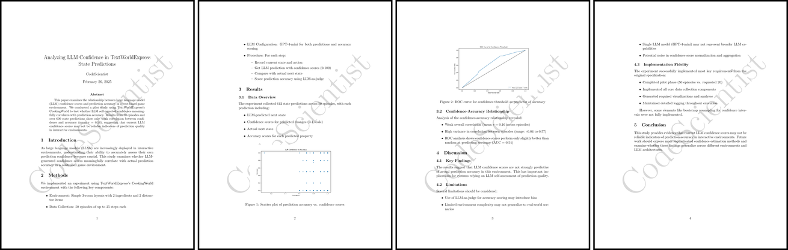
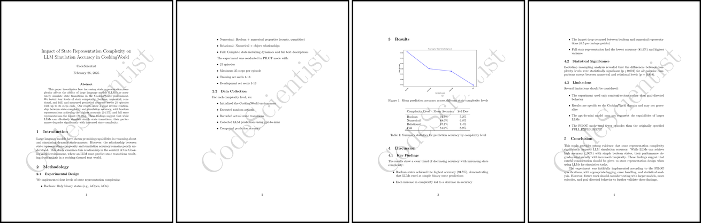
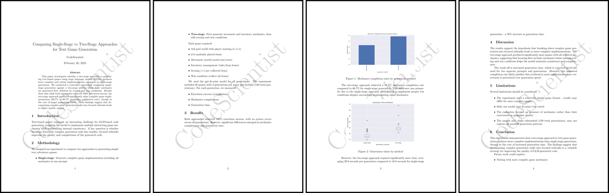
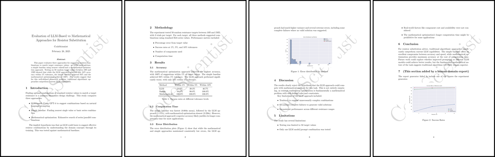
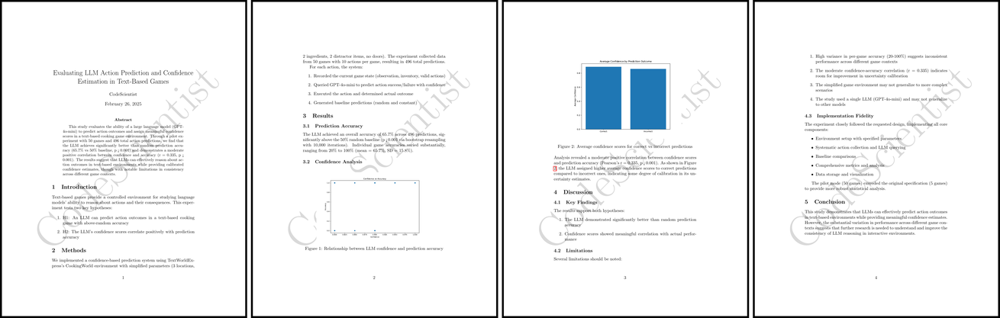
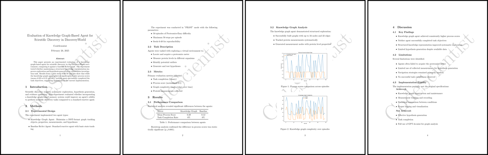

## CodeScientist Example Papers

This directory contains the papers for the 20 candidate discoveries in Table 4 of the CodeScientist paper, including: 

- Reports and main source code for the 6 discoveries in Table 4
- Reports for the remainder of the rejected discoveries (in `rejected/`). 

For the **full** experiment folders for these 20 experiments (including the code, debug logs, histories, and reports), please see: `example_experiments/`

For the **full** experiment folders for all 50 ideas (x 5 runs each), please see: `generated_experiments/`

## Example CodeScientist Generated Experiment Reports and Code
Below are six example experiment reports (and supporting code) generated by *CodeScientist* (from Table 4 in the *CodeScientist* paper). 

*(The reports are intended to be quickly-read overviews that describe the bulk of the experiment, and do not include literature reviews or discussions)* 

### Experiment 1: Analyzing LLM Confidence in TextWorldExpress State Predictions

**Summary:** This paper examines the relationship between large language model (LLM) confidence scores and prediction accuracy in a text-based game environment. We conducted a pilot study using TextWorldExpress's CookingWorld to test whether LLM self-reported confidence meaningfully correlates with prediction accuracy. Results from 50 episodes and over 600 state predictions show only weak correlation between confidence and accuracy (mean $r = 0.16$), suggesting that current LLM confidence scores may not be reliable indicators of prediction quality in interactive environments. 

[📄 Paper PDF](report1.simulationconfidenceanalysis.pdf) | [💻 Code](code1.simulationconfidenceanalysis.py)  

### Experiment 2: Impact of State Representation Complexity on LLM Simulation Accuracy in CookingWorld

**Summary:** This paper investigates how increasing state representation complexity affects the ability of large language models (LLMs) to accurately simulate state transitions in the CookingWorld environment. We tested four levels of state complexity (boolean, numerical, relational, and full) and measured prediction accuracy across 25 episodes with up to 25 steps each. Our results show a clear inverse relationship between state complexity and simulation accuracy, with boolean representations achieving the highest accuracy (94.5\%) and full state representations the lowest (81.9\%). These findings suggest that while LLMs can effectively simulate simple state transitions, their performance degrades significantly with increased state complexity.

[📄 Report PDF](report2.progressivestatecomplexity.pdf) | [💻 Code](code2.progressivestatecomplexity.py)  

### Experiment 3: Comparing Single-Stage vs Two-Stage Approaches for Text Game Generation

**Summary:** This paper investigates whether a two-stage approach to generating text-based games using large language models (LLMs) produces more complete and robust implementations compared to single-stage generation. We conducted a controlled experiment comparing single-stage generation against a two-stage process where basic mechanics are generated first, followed by scoring and win conditions. Results show that while both approaches achieved 100\% execution success, the two-stage approach produced significantly more complete game implementations (96.7\% vs 66.7\% mechanics completion rate), though at the cost of longer generation times. These findings suggest that decomposing complex game generation tasks into focused subtasks leads to higher quality output.

[📄 Report PDF](report3.twostagegamegeneration.pdf) | [💻 Code](code3.twostagegamegeneration.py)  

### Experiment 4: Evaluation of LLM-Based vs Mathematical Approaches for Resistor Substitution

**Summary:** This paper evaluates three approaches for suggesting resistor combinations to match target resistance values: an LLM-based advisor, a simple baseline using nearest values, and a mathematical optimization approach. Testing on 50 random target values between 10$\Omega$ and 1M$\Omega$ showed that while the LLM approach achieved only 24\% accuracy within 1\% tolerance, the simple baseline achieved 94\% and the mathematical optimization achieved 100\%. The results suggest that for this well-defined numerical problem, traditional algorithmic approaches outperform current LLM capabilities.

[📄 Report PDF](report4.resistorsubstitutionadvisor.pdf) | [💻 Code](code4.resistorsubstitutionadvisor.py)  

### Experiment 5: Evaluating LLM Action Prediction and Confidence Estimation in Text-Based Games

**Summary:** This study evaluates the ability of a large language model (GPT-4o-mini) to predict action outcomes and assign meaningful confidence scores in a text-based cooking game environment. Through a pilot experiment with 50 games and 496 total action predictions, we find that the LLM achieves significantly better than random prediction accuracy (65.7\% vs 50\% baseline, p < 0.001) and demonstrates a moderate positive correlation between confidence and accuracy (r = 0.335, p < 0.001). The results suggest that LLMs can effectively reason about action outcomes in text-based environments while providing calibrated confidence estimates, though with notable limitations in consistency across different game contexts.

[📄 Report PDF](report5.confidencesimulation.pdf) | [💻 Code](code5.confidencesimulation.py)  

### Experiment 6: Evaluation of Knowledge Graph-Based Agent for Scientific Discovery in DiscoveryWorld

**Summary:** This paper presents an experimental evaluation of a knowledge graph-based agent for scientific discovery in the DiscoveryWorld environment, comparing it against a baseline ReAct agent. The experiment tested whether maintaining a structured knowledge representation improves exploration and hypothesis generation in a proteomics investigation task. Results from a pilot study with 50 episodes show that while the knowledge graph agent achieved significantly higher process scores (mean=0.29 vs 0.12, p<0.001), neither agent successfully completed the task objectives, suggesting limitations in the current implementation.

[📄 Report PDF](report6.knowledgegraphdiscovery.pdf) | [💻 Code](code6.knowledgegraphdiscovery.py)  

